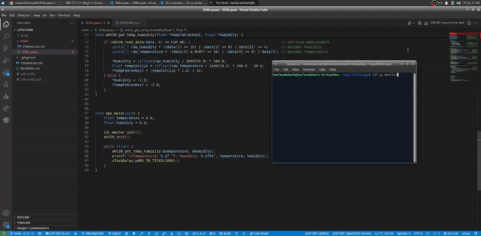

# little-paw
IoT device built using an ESP32 + AHT20 to track University of Houston's current temperature and humidity! Check out the data real-time at [*URL TBA*]!

     

## Hardware Requirements

*   ESP32
*   AHT20
*   Jumper wires
*   Breadboard

## Software Requirements

*   ESP-IDF

## Building and Installation

1.  Clone the repository: `git clone https://...`
2.  Open the project in VS Code using ESP-IDF
3.  Set the target: `idf.py set-target esp32`
4.  Set project configuration: `idf.py menuconfig`
5.  Build the project: `idf.py all`
6.  Connect ESP32 and check the serial port: `ls /dev/ttyUSB*`
7.  Flash the serial port: `idf.py -p /dev/ttyUSB0 flash`
8.  Monitor the output: `idf.py -p /dev/ttyUSB0 monitor`